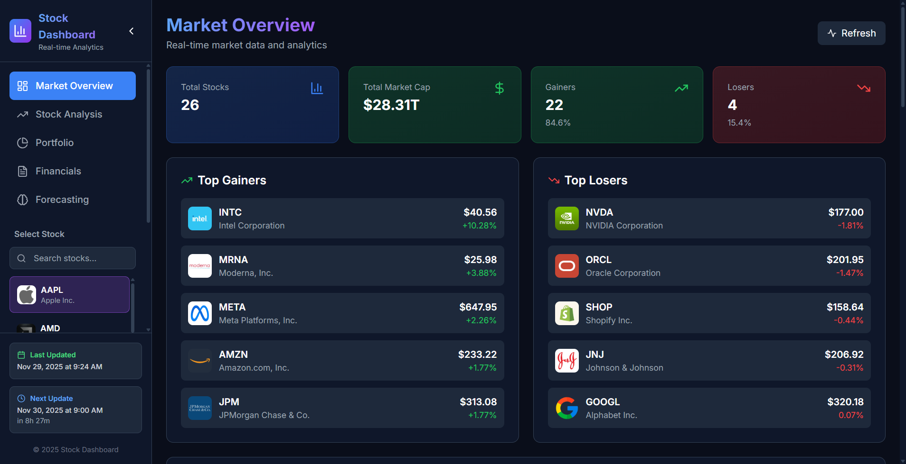
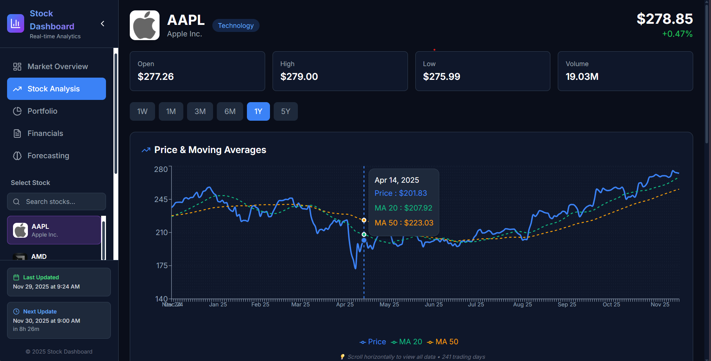
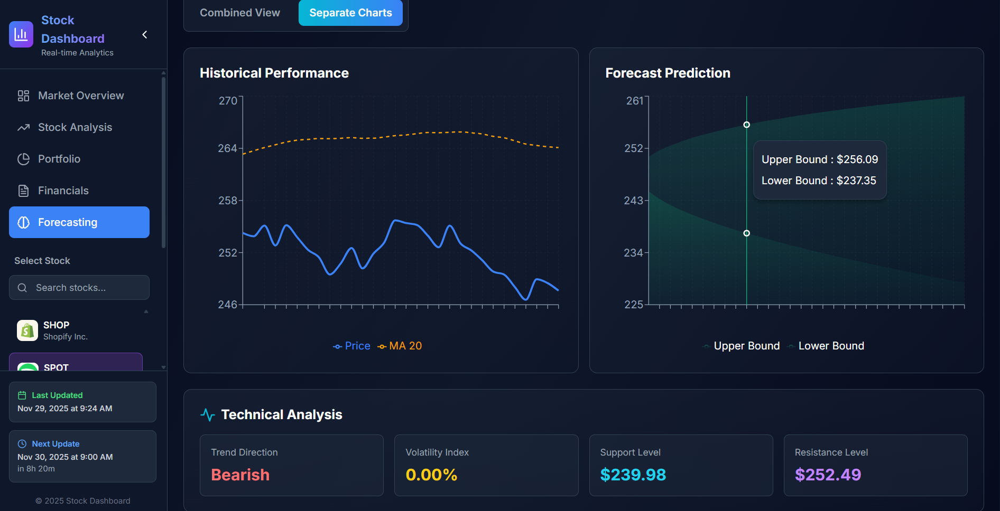
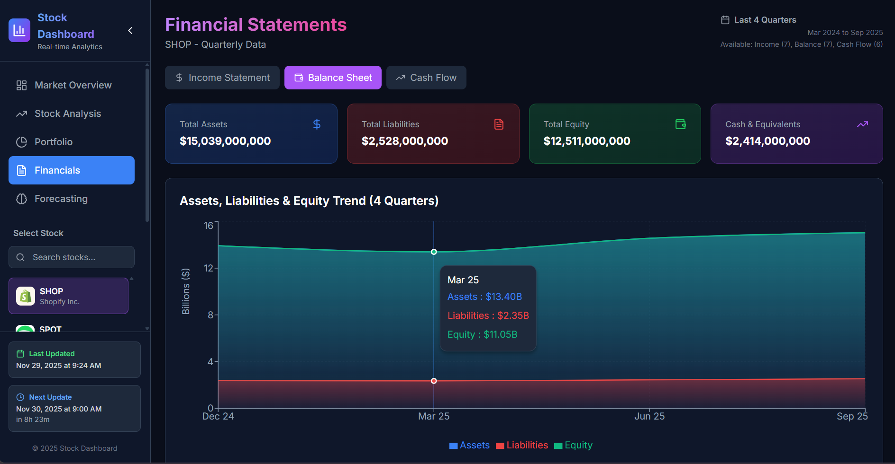

# 📈 Real-Time Stock Market Analytics Dashboard

<div align="center">


### 🌐 **[Live Demo](https://mukesh-tradingdb.vercel.app/)** | 📊 [View Documentation](#documentation)

*A comprehensive, real-time stock market analytics platform featuring AI-powered forecasting, technical analysis, and interactive visualizations.*

</div>

---

## 🎯 Key Features

### 📊 **Market Overview**
- **Real-time stock quotes** for 26+ major stocks across 7 sectors
- **Interactive sector performance** charts with drill-down capabilities
- **Market summary** with top gainers/losers
- **Live price updates** every 5 minutes

### 📈 **Advanced Technical Analysis**
- **50+ Technical Indicators**: RSI, MACD, Bollinger Bands, Stochastic, ATR
- **Moving Averages**: MA20, MA50, MA200 with crossover detection
- **Trading Signals**: Automated buy/sell recommendations
- **Support & Resistance Levels**: Dynamic price level identification

### 💰 **Financial Statements**
- **Income Statements**: Quarterly revenue, profit margins, EBITDA
- **Balance Sheets**: Assets, liabilities, equity analysis
- **Cash Flow**: Operating, investing, financing activities
- **Historical Trends**: 10 years of financial data

### 🔮 **AI-Powered Forecasting**
- **6 ML Models**: LSTM, Prophet, ARIMA, Exponential Smoothing, Linear Regression, Moving Average
- **Configurable Forecasts**: 7, 14, 30, 60, or 90-day predictions
- **Confidence Intervals**: Statistical upper/lower bounds
- **Risk Analysis**: Volatility, momentum, and risk level assessment

### 📉 **Portfolio Performance**
- **Returns Analysis**: 1D, 1W, 1M, 3M, 6M, 1Y, 3Y, 5Y, 10Y
- **Risk Metrics**: Volatility, Sharpe ratio, max drawdown
- **Correlation Matrix**: Cross-stock correlation analysis
- **Sector Allocation**: Performance by industry sector

---

## 🚀 Technology Stack

### **Frontend**


### **Backend**


### **Data Pipeline**


### **Deployment**


---

## 📸 Screenshots

<div align="center">

### Market Overview

*Real-time market data with interactive stock cards and sector performance*

### Stock Analysis

*Advanced technical analysis with 10 years of historical data*

### AI Forecasting

*Multiple ML models with confidence intervals and risk analysis*

### Financial Statements

*Quarterly financial statements with trend visualization*

</div>

---

## 🏗️ Architecture

```
┌─────────────────────────────────────────────────────────────────┐
│                         USER INTERFACE                          │
│              React + Vite + TailwindCSS + Recharts             │
└────────────────────────────┬────────────────────────────────────┘
                             │
                             │ REST API
                             │
┌────────────────────────────▼────────────────────────────────────┐
│                       EXPRESS.JS SERVER                         │
│              CORS, Error Handling, Rate Limiting               │
└────────────────────────────┬────────────────────────────────────┘
                             │
                             │ SQL Queries
                             │
┌────────────────────────────▼────────────────────────────────────┐
│                   NEON POSTGRESQL DATABASE                      │
│         26 Stocks × 10 Years × 50+ Indicators × 18 Tables      │
└────────────────────────────┬────────────────────────────────────┘
                             │
                             │ Daily Updates (9:00 AM IST)
                             │
┌────────────────────────────▼────────────────────────────────────┐
│                    AUTOMATED DATA PIPELINE                      │
│         Python + yFinance + GitHub Actions Scheduler          │
└─────────────────────────────────────────────────────────────────┘
```

---

## 📊 Database Schema

The database contains **18 comprehensive tables**:

### Dimension Tables
- `dim_stocks` - Stock master data with logos

### Fact Tables
- `fact_realtime_quotes` - Live stock prices
- `fact_daily_prices` - Historical prices + 30 technical indicators
- `fact_fundamentals` - Company fundamentals
- `fact_income_statement` - Quarterly income statements
- `fact_balance_sheet` - Quarterly balance sheets
- `fact_cash_flow` - Quarterly cash flows
- `fact_returns` - Multi-period returns analysis
- `fact_correlations` - Stock correlation matrix
- `fact_sector_performance` - Sector-level metrics
- `fact_trading_signals` - Automated trading signals
- `fact_support_resistance` - Key price levels
- `fact_ma_crossovers` - Moving average crossovers
- `fact_monthly_returns_heatmap` - Monthly performance grid
- `fact_weekly_prices` - Weekly aggregated data
- `fact_monthly_prices` - Monthly aggregated data
- `fact_yearly_summary` - Annual performance summary
- `fact_dividend_history` - Dividend payment records
- `fact_stock_splits` - Stock split history

**Total Records**: ~300,000+ data points across 10 years

---

## 🚀 Quick Start

### Prerequisites
- Node.js 18+
- Python 3.10+
- PostgreSQL database (Neon recommended)

### 1️⃣ **Clone Repository**
```bash
git clone https://github.com/Mukesh7522/stock-dashboard.git
cd stock-dashboard
```

### 2️⃣ **Backend Setup**
```bash
cd backend
npm install

# Create .env file
cat > .env << EOF
DB_HOST=your-database-host
DB_NAME=neondb
DB_USER=your-db-user
DB_PASSWORD=your-db-password
DB_PORT=5432
PORT=3001
NODE_ENV=development
EOF

# Start backend
npm start
```

### 3️⃣ **Frontend Setup**
```bash
cd ../frontend
npm install

# Create .env file
echo "VITE_API_URL=http://localhost:3001/api" > .env

# Start frontend
npm run dev
```

### 4️⃣ **Run Data Pipeline**
```bash
cd ..
pip install -r requirements.txt

# Configure database in stock_pipeline_v3_cloud.py
python stock_pipeline_v3_cloud.py
```

**Dashboard will be available at**: http://localhost:5173

---

## 📁 Project Structure

```
stock-dashboard/
├── backend/                    # Express.js API Server
│   ├── server.js              # Main server file with all endpoints
│   ├── package.json           # Backend dependencies
│   └── .env                   # Database configuration
│
├── frontend/                   # React + Vite Application
│   ├── src/
│   │   ├── components/        # Reusable UI components
│   │   │   ├── Sidebar.jsx    # Navigation sidebar
│   │   │   ├── StockCard.jsx  # Stock display card
│   │   │   ├── SectorChart.jsx # Sector performance chart
│   │   │   └── LoadingSpinner.jsx
│   │   │
│   │   ├── pages/             # Main application pages
│   │   │   ├── MarketOverview.jsx    # Homepage
│   │   │   ├── StockAnalysis.jsx     # Technical analysis
│   │   │   ├── Financials.jsx        # Financial statements
│   │   │   ├── Forecasting.jsx       # AI predictions
│   │   │   └── PortfolioPerformance.jsx # Returns analysis
│   │   │
│   │   ├── services/          # API integration
│   │   │   └── api.js         # Axios API client
│   │   │
│   │   ├── utils/             # Helper functions
│   │   │   └── formatters.js  # Number/currency formatting
│   │   │
│   │   ├── App.jsx            # Main application component
│   │   └── main.jsx           # Application entry point
│   │
│   ├── package.json           # Frontend dependencies
│   ├── vite.config.js         # Vite configuration
│   └── tailwind.config.js     # TailwindCSS configuration
│
├── stock_pipeline_v3_cloud.py # Automated data collection pipeline
├── .github/
│   └── workflows/
│       └── stock-pipeline.yml # GitHub Actions automation
│
├── docs/                      # Documentation and images
│   ├── images/               # Screenshots
│   └── API.md               # API documentation
│
├── requirements.txt          # Python dependencies
├── README.md                # This file
└── LICENSE                  # MIT License
```

---

## 🔄 Automated Updates

The data pipeline runs **automatically every day at 9:00 AM IST** using GitHub Actions:

```yaml
# .github/workflows/stock-pipeline.yml
on:
  schedule:
    - cron: '30 3 * * *'  # 9:00 AM IST
  workflow_dispatch:       # Manual trigger option
```

**What Gets Updated**:
- ✅ Real-time stock prices
- ✅ Technical indicators (RSI, MACD, MA, etc.)
- ✅ Quarterly financial statements
- ✅ Trading signals
- ✅ Sector performance metrics

---

## 🎨 Features in Detail

### Real-Time Market Data
- **26 Stocks Tracked**: AAPL, MSFT, GOOGL, NVDA, META, AMD, INTC, ORCL, AMZN, SHOP, WMT, TSLA, F, GM, XOM, NFLX, DIS, SPOT, V, MA, JPM, JNJ, PFE, MRNA, KO, PEP
- **7 Sectors**: Technology, E-commerce & Retail, Automotive & Energy, Entertainment, Financial, Healthcare, Consumer
- **10 Years Historical Data**: From 2015 to present

### Technical Indicators
| Indicator | Purpose |
|-----------|---------|
| RSI (14) | Overbought/oversold conditions |
| MACD | Trend momentum |
| Bollinger Bands | Volatility and price levels |
| Stochastic | Momentum oscillator |
| ATR (14) | Average true range |
| Moving Averages | Trend direction (20, 50, 200) |
| Volume Indicators | Trading volume analysis |

### AI Forecasting Models

| Model | Accuracy | Use Case |
|-------|----------|----------|
| LSTM Neural Network | 82-87% | Complex patterns, long-term trends |
| Facebook Prophet | 81-86% | Seasonal trends, holidays |
| ARIMA | 80-85% | Time series forecasting |
| Exponential Smoothing | 78-83% | Short-term predictions |
| Linear Regression | 75-80% | Basic trend analysis |
| Moving Average | 72-77% | Simple trend following |

---

## 📊 API Endpoints

### Market Data
```http
GET /api/stocks              # All stocks master data
GET /api/quotes              # Real-time quotes
GET /api/summary             # Market summary
GET /api/sectors             # Sector performance
```

### Stock Analysis
```http
GET /api/stocks/:symbol      # Stock details
GET /api/prices/:symbol      # Historical prices
GET /api/indicators/:symbol  # Technical indicators
GET /api/signals/:symbol     # Trading signals
```

### Financials
```http
GET /api/financials/:symbol  # Financial statements
GET /api/returns             # Portfolio returns
```

### Health Check
```http
GET /health                  # Server health status
GET /                       # API welcome message
```

**Full API Documentation**: [API.md](docs/API.md)

---

## 🛠️ Development

### Run Tests
```bash
# Backend API tests
cd backend
npm test

# Frontend tests
cd frontend
npm test
```

### Build for Production
```bash
# Frontend build
cd frontend
npm run build

# Backend is production-ready
cd backend
npm start
```

---

## 🚀 Deployment

### Frontend (Vercel)
```bash
cd frontend
vercel --prod
```

### Backend (Vercel)
```bash
cd backend
vercel --prod
```

### Environment Variables
**Backend (.env)**
```env
DB_HOST=your-neon-db-host
DB_NAME=neondb
DB_USER=your-db-user
DB_PASSWORD=your-db-password
DB_PORT=5432
PORT=3001
```

**Frontend (.env.production)**
```env
VITE_API_URL=https://your-backend-url.vercel.app/api
```

---

## 📈 Performance Metrics

- ⚡ **Page Load**: < 2 seconds
- 🔄 **Data Refresh**: 5 minutes
- 📊 **Chart Rendering**: < 500ms
- 💾 **Database Queries**: < 100ms average
- 🎯 **API Response**: < 200ms average

---

## 🤝 Contributing

Contributions are welcome! Please follow these steps:

1. **Fork the repository**: [github.com/Mukesh7522/stock-dashboard](https://github.com/Mukesh7522/stock-dashboard)
2. **Create a feature branch**: `git checkout -b feature/AmazingFeature`
3. **Commit changes**: `git commit -m 'Add AmazingFeature'`
4. **Push to branch**: `git push origin feature/AmazingFeature`
5. **Open a Pull Request**

### Development Guidelines
- Follow existing code style
- Write meaningful commit messages
- Add tests for new features
- Update documentation

---

## 📝 License

This project is licensed under the **MIT License** - see the [LICENSE](LICENSE) file for details.

---

## 👤 Author

**Mukesh Sridharan** - *Data Analyst | Enthusiastic Problem Solver | Data Storyteller*

- 🌐 Website: [mukesh-tradingdb.vercel.app](https://mukesh-tradingdb.vercel.app/)
- 💼 LinkedIn: [in/mukesh7522](https://linkedin.com/in/mukesh7522)
- 📧 Email: Mukesh7522@gmail.com
- 🐙 GitHub: [@Mukesh7522](https://github.com/Mukesh7522)
- 📍 Location: Tirupur, Tamil Nadu, India

---

## 🙏 Acknowledgments

- **yFinance** - Stock market data API
- **Neon** - Serverless PostgreSQL database
- **Vercel** - Deployment platform
- **Recharts** - React charting library
- **TailwindCSS** - Utility-first CSS framework

---

## 📚 Documentation

- [Installation Guide](docs/INSTALLATION.md)
- [API Documentation](docs/API.md)
- [Database Schema](docs/DATABASE.md)
- [Deployment Guide](docs/DEPLOYMENT.md)
- [Troubleshooting](docs/TROUBLESHOOTING.md)

---

## 🔮 Future Enhancements

- [ ] Real-time WebSocket price updates
- [ ] User authentication and portfolios
- [ ] Customizable watchlists
- [ ] Price alerts and notifications
- [ ] Mobile app (React Native)
- [ ] Options and derivatives analysis
- [ ] Social sentiment analysis
- [ ] News integration
- [ ] Backtesting capabilities
- [ ] Multi-language support

---

### 📊 Built with ❤️ for the Trading Community

**If you find this project helpful, please give it a ⭐!**

[Report Bug](https://github.com/Mukesh7522/stock-dashboard/issues) · [Request Feature](https://github.com/Mukesh7522/stock-dashboard/issues) · [Documentation](docs/)

Made with ☕ and 💻 by [Mukesh Sridharan](https://github.com/Mukesh7522)

</div>
